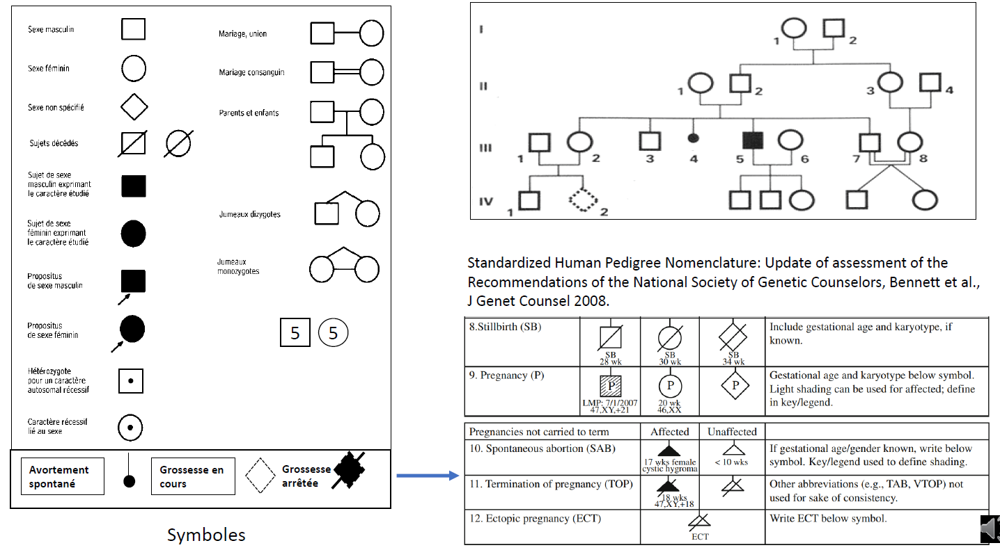

# Genetic Pedigree YOLO Dataset Generation

## Overview

This repository is dedicated to generating synthetic datasets of genetic pedigree charts for use with YOLO (You Only Look Once) object detection models. The dataset aims to simulate common symbols found in genealogical trees to help researchers and developers create models capable of detecting specific familial and medical markers on real-world genetic charts.

## Problem Statement

In genetics and medical research, pedigree charts (also known as family trees) are essential for visualizing hereditary patterns and medical history across generations. Pedigree charts often use distinct symbols to represent individuals and their relationships, as well as specific medical conditions and statuses, which are crucial for genetic counseling and research into hereditary diseases. However, manually annotated datasets of these symbols for machine learning purposes are scarce.

To address this issue, this project generates a synthetic dataset of symbols commonly found in genetic pedigree charts, represented in a YOLO-compatible format. Our dataset includes various classes of individuals with different attributes, such as gender, health status, and death, to facilitate the training of object detection models for recognizing these patterns.

## Classes and Symbols

In this dataset, we define the following classes, each represented by a unique symbol:



### Symbol Descriptions

1. **Male**: Represented as a black-bordered square.
2. **Female**: Represented as a black-bordered circle.
3. **Deceased Male**: A black-bordered square with a diagonal cross.
4. **Deceased Female**: A black-bordered circle with a diagonal cross.
5. **Affected Male (deceased)**: A red-filled square with a diagonal cross.
6. **Affected Female (deceased)**: A blue-filled circle with a diagonal cross.
7. **Index**: Indicated with an arrow, pointing to a specific individual in the pedigree.
8. **Affected Male**: A green-filled square.
9. **Affected Female**: A green-filled circle.

The symbols in the image above illustrate the different classes used in this dataset. Each class represents a specific familial or health-related attribute, aiding in the identification of hereditary patterns.

## Dataset Characteristics

The dataset contains the following features to make it suitable for robust training:

- **Random Rotations**: Each symbol is rotated randomly to introduce variety in orientation.
- **Connection Lines**: Random lines connect symbols to simulate real genealogical trees, adding contextual complexity to the dataset.
- **Synthetic Noise**: Random noise is applied to each image to simulate varying levels of image quality and help improve model robustness.
- **YOLO Format**: Each symbol is labeled with bounding boxes in YOLO format, making it compatible with YOLOv5 and YOLOv8 models.

## Dataset Structure

```plaintext
.
├── images/
│   ├── train/
│   ├── val/
│   └── test/
└── labels/
    ├── train/
    ├── val/
    └── test/
```

# TO DO : 

- Fix the bug of long squares tubes 
- Fix the creation of arrows (incorrect bounding boxes)
- Add drawings forms some ideas : 

1. **Matplotlib + Path Effects** :
   - Matplotlib propose des effets de chemin (**Path Effects**) qui peuvent être utilisés pour donner un aspect dessiné à la main. En utilisant des lignes irrégulières ou en ajoutant du bruit, on peux obtenir des formes avec un style plus naonrel.
   - On peux ajouter des effets de tremblement aux lignes pour les rendre moins précises, et ainsi donner l'impression qu'elles ont été tracées à main levée.

2. **Pillow + Bezier Curves** :
   - Avec **Pillow** et l’ajout de courbes de Bézier, on peux dessiner des formes légèrement irrégulières, en variant légèrement les coordonnées des points. En ajoutant du bruit ou des distorsions, les lignes se rapprochent d’un style manuscrit.
   - Il est aussi possible d’appliquer des filtres pour accenoner les contours ou faire un léger flou pour un effet encore plus naonrel.

3. **Manim** :
   - **Manim** est une bibliothèque de création d’animations mathématiques, mais elle est aussi capable de créer des formes stylisées. En utilisant des paramètres spécifiques (comme les trajectoires d’animations), on peux obtenir des dessins qui semblent avoir été tracés à main levée.
   
4. **Handright** :
   - Pour générer directement du texte manuscrit, la bibliothèque **Handright** est aussi utile, car elle applique des distorsions et variations aléatoires sur les lettres et les formes.

5. **Custom Perlin Noise** :
   - Pour une approche plus avancée, l’application de bruit de Perlin sur les contours des formes peut donner des lignes sinueuses et irrégulières. En modifiant les positions des points d’une forme géométrique, on peux obtenir cet effet manuscrit.

6. **Utiliser le dataset** https://github.com/frobertpixto/hand-drawn-shapes-dataset/ 
